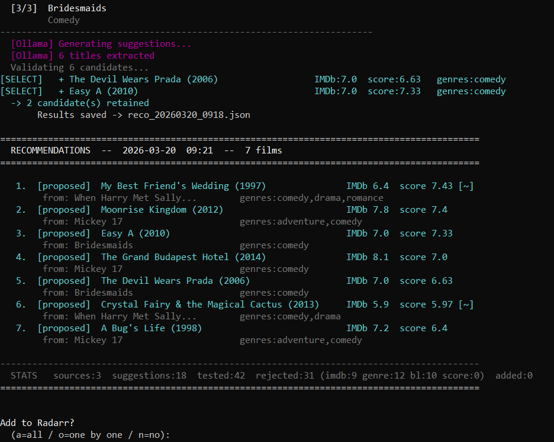
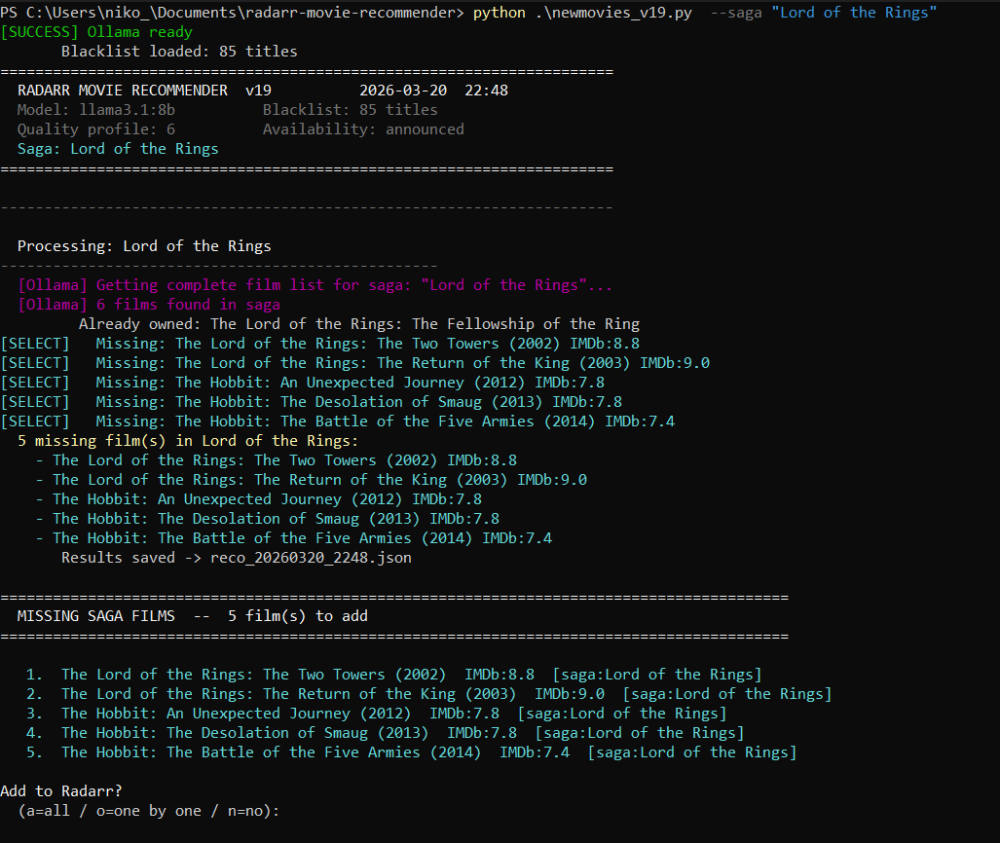
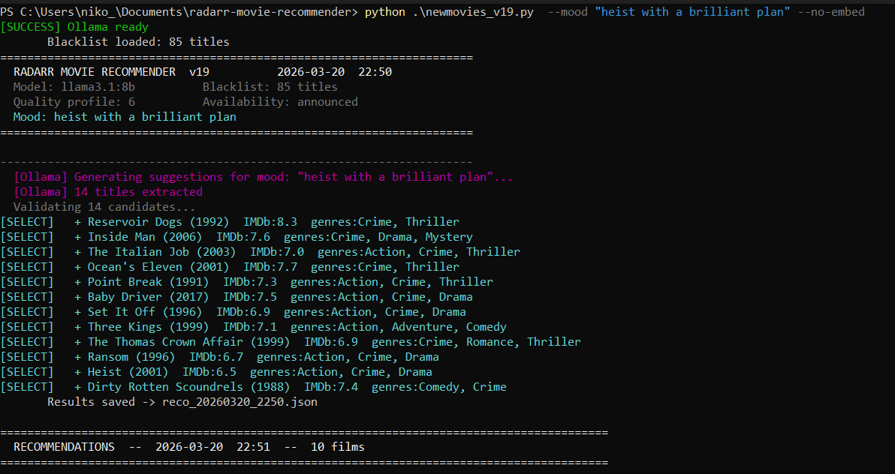

# Radarr Movie Recommender

[](https://github.com/nikodindon/radarr-movie-recommender)
[](https://www.python.org/)
[](https://opensource.org/licenses/MIT)
[](https://github.com/nikodindon/radarr-movie-recommender/commits/main)

A Python script that finds movies you'll actually want to watch — and adds them to Radarr automatically.

Now with saga completion: automatically detect and fill gaps in your film franchises.

It uses a **local LLM (Ollama)** to understand the theme, tone and atmosphere of your films, not just their genre or cast. No external AI API. No Docker. No subscription.

---

## What makes it different

Most recommendation tools match by genre or popularity. This one asks a local LLM to reason about your films the way a cinephile would — then validates and scores every suggestion before adding anything.

A few things you can do that most tools can't:

**Describe the mood you're after:**
```bash
python newmovies.py --mood "dark and intense"
python newmovies.py --mood "time travel and temporal paradoxes"
python newmovies.py --mood "feel good sunday afternoon"
python newmovies.py --mood "mind-bending with a twist ending"
python newmovies.py --mood "survival against all odds"
```

**Get recommendations from any film — even one you don't own:**
```bash
python newmovies.py --like "Parasite"
python newmovies.py --like "Oppenheimer"
```

**Combine both:**
```bash
python newmovies.py --like "Inception" --mood "mind-bending"
python newmovies.py --mood "slow burn thriller" --genre "Crime"
```

**Complete an entire franchise in one command:**
```bash
python newmovies.py --saga "Star Wars"
python newmovies.py --saga "Lord of the Rings"
python newmovies.py --saga  # auto-detect ALL incomplete sagas in your library
```

**Explore a filmmaker or artist's complete filmography:**
```bash
python newmovies.py --director "Stanley Kubrick"   # all films you're missing
python newmovies.py --director "Wes Anderson"
python newmovies.py --actor "Al Pacino"
python newmovies.py --composer "John Williams"
python newmovies.py --author "Stephen King"        # all film adaptations
```

**Or just let it run automatically every night:**
```bash
python newmovies.py --auto
```

---

## Preview

**Classic mode** — recommendations based on your library:


**Saga mode** — automatically complete a franchise:


**Mood mode** — find films by atmosphere:


---

## Some actual results

| Source | Recommended |
|---|---|
| Pulp Fiction | Reservoir Dogs *(same director)*, L.A. Confidential, Miller's Crossing |
| The Thing | In the Mouth of Madness, It Follows, The Descent |
| In Bruges | Seven Psychopaths *(same director + cast)*, Dead Man's Shoes, The Proposition |
| Whiplash | La La Land, Birdman, All That Jazz |
| `--mood "dark and intense"` | No Country for Old Men, Martyrs, Let the Right One In, The Handmaiden |
| `--mood "time travel and temporal paradoxes"` | 2001: A Space Odyssey, 12 Monkeys, Predestination, Timecrimes, Mr. Nobody |
| `--like "Parasite"` | The Handmaiden, Shoplifters, Dogtooth, A Separation |
| `--saga "Star Wars"` | Finds all 10 missing Episodes + Rogue One + Solo |
| `--saga "Die Hard"` | Die Hard 2, Die Hard with a Vengeance, Live Free or Die Hard |
| `--saga` (auto) | Detects Rocky, LotR, Back to the Future, Matrix... all incomplete |
| `--director "Wes Anderson"` | Bottle Rocket, Rushmore, Royal Tenenbaums, Grand Budapest Hotel... |
| `--actor "Al Pacino"` | Serpico, Dog Day Afternoon, Godfather II, Scarface, Carlito's Way... |
| `--composer "John Williams"` | Jaws, Raiders, Home Alone, Schindler's List, Empire Strikes Back... |
| `--author "Stephen King"` | Carrie, The Shining, Stand by Me, Misery, The Mist... |

---

## How it works

```
Your Radarr library (random sample)
           │
           ▼
  Ollama generates similar titles
  (understands theme, tone, atmosphere)
           │
           ▼
  OMDb validates each suggestion
  (rating, year, genre, not already owned)
           │
           ▼
  Scoring: genre + director + cast + plot embeddings
           │
           ▼
  Top results added to Radarr automatically
```

**Scoring signals:**

| Signal | Points |
|---|---|
| Genre match | +3 to +5 |
| Same director | +4 |
| Shared cast | +2 per actor |
| Plot similarity (embeddings) | 0 to +6 |
| IMDb rating | 0 to +3.3 |
| Era proximity | +0.8 to +1.5 |
| Suggested by multiple sources | +0.8 per extra source |

---

## Requirements

- Python 3.10+
- [Ollama](https://ollama.com/) running locally with `llama3.1:8b` pulled
- A running [Radarr](https://radarr.video/) instance
- A free [OMDb API key](https://www.omdbapi.com/apikey.aspx) (1000 req/day, free tier)

---

## Installation

```bash
git clone https://github.com/nikodindon/radarr-movie-recommender.git
cd radarr-movie-recommender
pip install -r requirements.txt
ollama pull llama3.1:8b
cp config.yaml.example config.yaml   # then edit with your settings
```

**config.yaml:**
```yaml
omdb_keys: your_key1,your_key2
radarr_api_key: your_radarr_api_key
radarr_url: http://localhost:7878/api/v3
root_folder: "D:\\Movies"
ollama_model: llama3.1:8b
quality_profile_id: 6
minimum_availability: announced
```

| Setting | Description |
|---|---|
| `omdb_keys` | Comma-separated OMDb keys — get free ones at [omdbapi.com](https://www.omdbapi.com/apikey.aspx) |
| `radarr_api_key` | Radarr → Settings → General |
| `quality_profile_id` | Radarr → Settings → Profiles |
| `minimum_availability` | `announced`, `inCinemas`, or `released` |

> `config.yaml` is gitignored and never committed.

---

## Usage

```bash
# Standard run — review and choose
python newmovies.py

# Add everything automatically
python newmovies.py --auto

# By mood
python newmovies.py --mood "dark and intense"
python newmovies.py --mood "feel good" --genre "Comedy"

# Based on a specific film
python newmovies.py --like "Parasite"
python newmovies.py --like "Inception" --mood "mind-bending"

# By genre
python newmovies.py --genre "Horror" --auto
python newmovies.py --genre "Sci-Fi" --sources 8

# Complete a saga / franchise
python newmovies.py --saga "Star Wars"
python newmovies.py --saga "Harry Potter"
python newmovies.py --saga "Lord of the Rings"
python newmovies.py --saga          # auto-detect all incomplete sagas

# Explore a filmography
python newmovies.py --director "Stanley Kubrick"
python newmovies.py --actor "Al Pacino"
python newmovies.py --composer "Ennio Morricone"
python newmovies.py --author "Philip K. Dick"
python newmovies.py --actor "Al Pacino" --artist-top 20  # limit to top 20

# Reset the blacklist
python newmovies.py --resetblacklist
```

**All options:**

| Argument | Default | Description |
|---|---|---|
| `--auto` | off | Add all recommendations without prompting |
| `--mood` | off | Describe the atmosphere you want in plain language |
| `--like` | off | Base recommendations on a specific film title |
| `--genre` | off | Filter by genre (`Sci-Fi`, `Horror`, `Comedy,Romance`...) |
| `--sources` | 10 | Number of source films to sample from your library |
| `--suggestions` | 14 | Ollama suggestions per source film |
| `--top` | 10 | Number of final recommendations to keep |
| `--score` | 6.5 | Minimum IMDb rating |
| `--score-relax` | 5.9 | IMDb threshold in relaxed fallback mode |
| `--sd` | 1970 | Minimum release year |
| `--fd` | 2030 | Maximum release year |
| `--no-embed` | off | Disable plot embeddings (faster, less precise) |
| `--saga` | off | Complete a franchise: `--saga "Star Wars"` or `--saga` for auto-detection |
| `--director` | off | Add missing films by a director (e.g. `--director "Kubrick"`) |
| `--actor` | off | Add missing films featuring an actor (e.g. `--actor "Al Pacino"`) |
| `--composer` | off | Add missing films scored by a composer (e.g. `--composer "Hans Zimmer"`) |
| `--author` | off | Add missing film adaptations of an author (e.g. `--author "Stephen King"`) |
| `--artist-top` | 0 | Limit filmography results (0 = all, useful for actors with huge careers) |
| `--resetblacklist` | off | Clear the blacklist file |
| `--debug` | off | Verbose output |

---

## Daily automation

Set it up once and wake up to new movies every morning:

**Windows (Task Scheduler):**
```powershell
$action = New-ScheduledTaskAction `
    -Execute "python" `
    -Argument "C:\path\to\newmovies.py --auto"
$trigger = New-ScheduledTaskTrigger -Daily -At "03:00"
Register-ScheduledTask -TaskName "RadarrRecommender" `
    -Action $action -Trigger $trigger -RunLevel Highest
```

**Linux/Mac (cron):**
```bash
0 3 * * * cd /path/to/radarr-movie-recommender && python newmovies.py --auto
```

---

## Update

```bash
cd radarr-movie-recommender
git pull
```

Your `config.yaml`, `blacklist.json` and logs are never overwritten — they are gitignored.

---

## Files created at runtime

| File | Description |
|---|---|
| `blacklist.json` | Films already proposed or in your library — never suggested again |
| `omdb_apikey.conf` | Active OMDb key (auto-rotated when quota is reached) |
| `reco_YYYYMMDD_HHMM.json` | Full scored results of each run |
| `logs/reco_YYYYMMDD_HHMM.log` | Detailed log with every decision |

---

## Notes

- Works on Windows, Linux and Mac
- The `--no-embed` flag skips semantic embeddings for faster runs
- When refusing a film in interactive mode, you can choose whether to blacklist it or keep it for later
- If Ollama returns too few suggestions, the script falls back to OMDb search by director/genre/cast
- Multiple free OMDb keys can be added — the script rotates them automatically on quota

---

If you find this useful, a ⭐ on GitHub is always appreciated!
