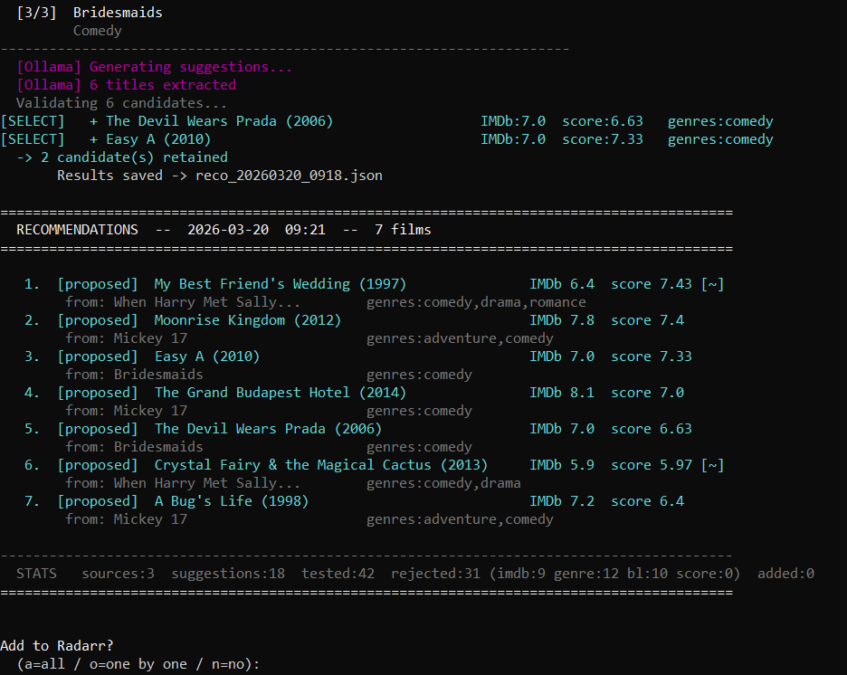
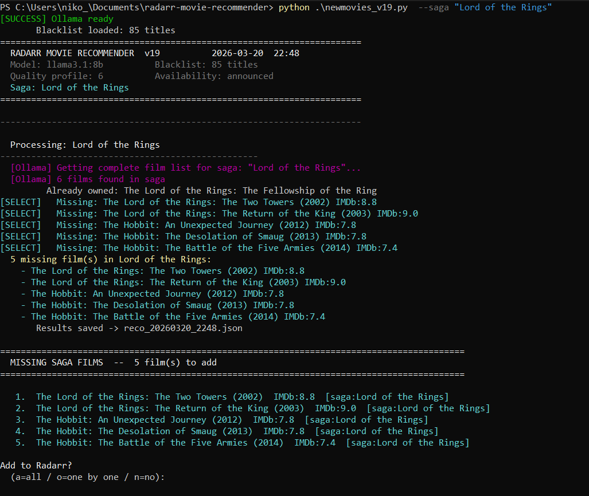
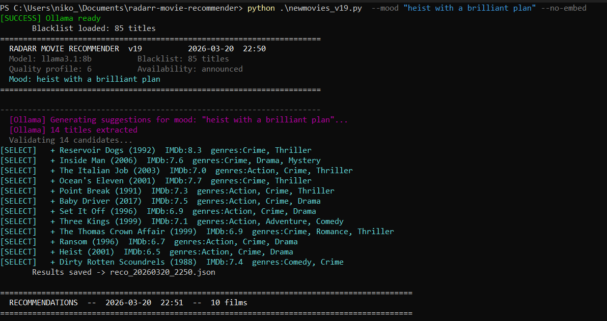

# Radarr Movie Recommender

[](https://github.com/nikodindon/radarr-movie-recommender)
[](https://www.python.org/)
[](https://opensource.org/licenses/MIT)
[](https://github.com/nikodindon/radarr-movie-recommender/commits/main)

**A local AI companion for Radarr** : finds films you'll actually want to watch, completes your collections, and analyzes your taste. No API key, no cloud, no subscription. Just Ollama running on your machine.

### The simplest use case — set it and forget it

Run it once manually, pick the films you want, or just let it add everything automatically:

```bash
python newmovies.py          # review and choose
python newmovies.py --auto   # add top 10 recommendations silently
```

Set it as a scheduled task and wake up every morning with new films already added to Radarr:

**Windows (Task Scheduler):**
```powershell
$action = New-ScheduledTaskAction -Execute "python" -Argument "C:\path\to\newmovies.py --auto"
$trigger = New-ScheduledTaskTrigger -Daily -At "03:00"
Register-ScheduledTask -TaskName "RadarrRecommender" -Action $action -Trigger $trigger -RunLevel Highest
```

**Linux/Mac (cron):**
```bash
0 3 * * * cd /path/to/radarr-movie-recommender && python newmovies.py --auto
```

Your collection grows by itself , every morning if you want, 10 new films picked from your library's taste profile, validated against IMDb, added to Radarr and ready to download.

---

## What's new in the `dev` branch (V5.5 → V5.29)

The `dev` branch has 30+ improvements on top of `main` (last stable V5.0). Highlights:

- 🌐 **Web UI** (V5.5) — review recommendations in a browser, click Accept/Refuse/Blacklist, push in batch
- 🆕 **Interactive onboarding** (V5.25–V5.29) — `--onboard` for new Radarr libraries: 8 QCM + free-form answer → 21 personalised film suggestions
- 🔍 **OMDb search fallback** (V5.22) — `--omdb-fallback` fills gaps when the LLM forgets famous films (e.g. Paul Blart for Kevin James)
- 🎯 **Better role matching** (V5.18, V5.20) — actor/director/saga modes now verify the role actually matches before suggesting a film
- 🔧 **Cumulative filters** (V5.10–V5.14) — `--imdb-min`, `--sd`, `--fd`, `--genre` now work in **all** modes (saga, artist, mood, like)
- 🛡️ **State leak fix** (V5.23) — running a mood then a saga no longer carries the previous mood into the new run

To install the dev branch:

```bash
git clone -b dev https://github.com/nikodindon/radarr-movie-recommender.git
cd radarr-movie-recommender
pip install -r requirements.txt
cp config.yaml.example config.yaml
# Edit config.yaml with your settings (see Installation section below)
```

`main` is still the last "stable" snapshot; `dev` is the bleeding edge with the new features.

---

## Previews

**Classic mode** — recommendations based on your library:


**Saga mode** — automatically complete a franchise:


**Mood mode** — find films by atmosphere:


---

## Web UI — review recommendations in your browser

Vague 5 added a FastAPI-based web interface that replaces the terminal
prompts with clickable buttons. The CLI still works the same as before;
this is a separate entry point.

```bash
python newmovies.py --web --web-port 8765
# then open http://127.0.0.1:8765 in your browser
```

### What you get

- Pick the run mode (library, mood, like) from a form
- Watch the LLM + OMDb pipeline run with live log streaming
- See the 10 final recommendations as cards
- Click **Accept**, **Refuse**, or **Refuse + Blacklist** per film
- Click **Push to Radarr** at the bottom to commit accepted films in
  one batch — refuses are dropped, blacklisted films are saved to the
  blacklist so they never reappear

### Why the two-step flow

`Accept` records your decision in memory. The actual Radarr POST
happens on the final **Push to Radarr** button. This lets you change
your mind before anything is committed — the CLI behaves the same way
(`o` to review one by one, then commit at the end).

If you prefer immediate-add (every Accept pushes right away), tell me
and I'll flip the default.

### Arguments

| Argument | Default | Description |
|---|---|---|
| `--web` | off | Launch the web UI on the host (server blocks until killed) |
| `--web-port` | env `RADARR_RECO_WEB_PORT` or 8080 | Bind port — set this if 8080 is already taken (e.g. by llama-server) |
| `--web-host` | env `RADARR_RECO_WEB_HOST` or 127.0.0.1 | Bind address — set to `0.0.0.0` to expose on the LAN (no auth, trusted networks only) |

Resolution order: `--web-*` flag > `RADARR_RECO_WEB_*` env var > `config.yaml` `web:` section > default.

### How it works (one paragraph)

The web runner monkey-patches two module-level functions on
`newmovies` for the duration of one run: `cprint` (so log lines stream
to both stdout and the page) and `confirm_and_add` (so each candidate
is captured into in-memory state instead of prompting). The original
implementations are restored in a `finally` block, so the CLI is
untouched. The runner sets `args.dry_run=True` during the run to avoid
auto-adds, then temporarily flips it off during the `Push to Radarr`
button so `add_to_radarr` actually pushes.

---

## What you can do that no other tool offers

### 🎭 Describe what you're in the mood for — in plain English
```bash
python newmovies.py --mood "dark and intense psychological thriller"
python newmovies.py --mood "samurai and honor in feudal japan"
python newmovies.py --mood "noir detective in a rainy city"
python newmovies.py --mood "feel good sunday afternoon comedy"
python newmovies.py --mood "mind-bending sci-fi with a twist ending"
python newmovies.py --mood "heist with a brilliant plan" --imdb-min 7.5
```

### 🧪 Test without committing anything
```bash
python newmovies.py --dry-run        # shows what would be added, writes nothing
python newmovies.py --dry-run --limit 3   # stop after 3 simulated adds
```

### 🎬 Start from any film — even one you don't own
```bash
python newmovies.py --like "Parasite"
python newmovies.py --like "2001: A Space Odyssey" --mood "existential and slow burn"
python newmovies.py --like "Inception" --mood "mind-bending"
```

### 🎞️ Complete an entire franchise automatically
```bash
python newmovies.py --saga "Star Wars"          # finds every missing episode
python newmovies.py --saga "Planet of the Apes" # original + reboot series
python newmovies.py --saga                      # auto-detects ALL incomplete sagas
```

### 🎥 Explore complete filmographies
```bash
python newmovies.py --director "Stanley Kubrick"
python newmovies.py --actor "Al Pacino"
python newmovies.py --composer "Ennio Morricone" --export morricone.html
python newmovies.py --author "Cormac McCarthy"   # all film adaptations
```

### 👥 Multi-actor search — unique to this tool
```bash
# Films featuring ANY of these actors
python newmovies.py --actor "Ben Stiller, Owen Wilson"

# Films where ALL of them appear TOGETHER
python newmovies.py --cast "Ben Stiller, Owen Wilson"
# → Zoolander, Starsky & Hutch, Night at the Museum...

python newmovies.py --cast "Robert De Niro, Al Pacino"
# → The Godfather Part II, Heat, Righteous Kill
```

### 🧠 AI analysis of your collection
```bash
python newmovies.py --analyze
# → "Your collection excels at 90s drama but lacks Kurosawa, French New Wave..."
# → Suggests 10 films to fill the gaps

python newmovies.py --stats
# → Genre breakdown, decade distribution, average rating

python newmovies.py --watchlist letterboxd_watchlist.csv
# → Import directly from your Letterboxd or IMDb watchlist
```

### 📋 Review with full plot synopsis
```bash
python newmovies.py --actor "Al Pacino" --synopsis
# Shows full plot before you decide to add each film:
#   + Serpico (1973)  IMDb:7.7
#   │ An honest New York cop named Frank Serpico blows the whistle
#     on rampant corruption in the police department.
#   add? (y/n):
```

### 📤 Export to HTML or CSV
```bash
python newmovies.py --actor "Ennio Morricone" --export morricone.html
python newmovies.py --analyze --export gaps.csv
# → Beautiful dark-themed HTML report you can share
```

---

## Actual results

| Command | What it found |
|---|---|
| `--mood "dark and intense"` | No Country for Old Men, Martyrs, Let the Right One In |
| `--mood "samurai feudal japan"` | Seven Samurai, Rashomon, Yojimbo, Throne of Blood, Samurai Rebellion |
| `--mood "noir detective rainy city"` | Se7en, Double Indemnity, Chinatown, Maltese Falcon, Big Sleep |
| `--like "2001: A Space Odyssey"` | Solaris, Stalker, Silent Running, Moon, Arrival |
| `--saga "Star Wars"` | All 10 missing episodes + Rogue One + Solo |
| `--saga "Planet of the Apes"` | 6 missing films across original + reboot series |
| `--director "Stanley Kubrick"` | Full filmography, only missing titles |
| `--actor "Al Pacino"` | Serpico, Godfather I & II, Dog Day Afternoon, Scarface... |
| `--composer "Ennio Morricone"` | 19 missing films incl. GBU, Once Upon a Time in America |
| `--cast "De Niro, Pacino"` | Exactly 3 films where both appear: Godfather II, Heat, Righteous Kill |
| `--analyze` | Detected gaps in Kurosawa, Bergman, French New Wave → 10 suggestions |
| `--watchlist` | Imports Letterboxd/IMDb CSV directly into Radarr |

---

## How it works

```
Your Radarr library
        │
        ▼
  Ollama (local LLM) understands theme, tone, atmosphere
        │
        ▼
  OMDb validates each suggestion
  (rating, year, genre, not already owned)
        │
        ▼
  Scoring: genre + director + cast + plot embeddings
        │
        ▼
  Results added to Radarr — with your approval
```

**OMDb results are cached on disk** (`.omdb_cache.json` in the repo
root) so repeated runs on the same films don't burn through your 1000
requests/day limit. Cache hits return instantly, misses cost one
request. Cache survives across runs but is invalidated when you delete
the file.

---

## LLM backend — Ollama or llama.cpp (since dev branch)

The recommender needs a local LLM for film suggestions, saga detection, and
filmography generation. The script supports **two interchangeable backends**
via `config.yaml` → `llm_backend`:

| Backend      | When to use                                                                 | Pros                                | Cons                                 |
|--------------|-----------------------------------------------------------------------------|-------------------------------------|--------------------------------------|
| `ollama`     | You have Ollama installed locally (`ollama serve`)                          | Easy, well-tested, embeddings work  | Heavy runtime, separate service      |
| `llamacpp`   | You run a `llama-server` exposing the OpenAI-compatible API (port 8080)    | Direct GGUF, no Ollama overhead     | `/v1/embeddings` needs `--embeddings` |

**`llamacpp` example (recommended for users already on llama.cpp):**

```yaml
llm_backend: llamacpp
llm_model: /path/to/your-model.gguf    # exactly as /v1/models lists it
llamacpp_base_url: http://192.168.1.32:8080
```

Launch llama-server like this (the embeddings flag is optional, only needed
for plot-similarity scoring):

```bash
./llama-server -m your-model.gguf --host 0.0.0.0 --port 8080 -c 8192 [--embeddings]
```

**Notes specific to reasoning models** (Qwen, DeepSeek-R1, ornith-aeon, etc.):
the backend automatically forces `max_tokens >= 2048` so the chain-of-thought
doesn't eat the entire output budget. Expect ~30-90s per suggestion on a 35B
quantized model. For nightly cron runs that's fine; for interactive use,
consider a smaller model (8-14B) or enable the GPU offload.

**Fallback:** if the LLM is unreachable, the script still runs the Radarr +
OMDb pipeline — AI suggestions just return empty. The whole thing degrades
gracefully instead of crashing.

---

## Requirements

- Python 3.10+
- A local LLM: either [Ollama](https://ollama.com/) **or** [llama.cpp](https://github.com/ggerganov/llama.cpp) `llama-server`
- A running [Radarr](https://radarr.video/) instance
- A free [OMDb API key](https://www.omdbapi.com/apikey.aspx) (1000 req/day)

---

## Installation

```bash
git clone https://github.com/nikodindon/radarr-movie-recommender.git
cd radarr-movie-recommender
pip install -r requirements.txt
ollama pull llama3.1:8b
cp config.yaml.example config.yaml   # edit with your settings
```

**requirements.txt** (core + web UI):
```text
PyYAML
requests

# Web UI (optional — only needed for `python newmovies.py --web`)
fastapi
uvicorn
jinja2
python-multipart
```

The web UI deps are also installed by `pip install -r requirements.txt`,
so you don't have to install them separately. If you only ever use the
CLI, the web deps sit unused but cost ~30 MB of disk.

**config.yaml:** (`cp config.yaml.example config.yaml` and edit)
```yaml
# OMDb API keys (free at https://www.omdbapi.com/apikey.aspx, 1000 req/day each)
# You can list multiple keys — they're rotated when one hits the rate limit.
omdb_keys: a3421245,7cb5ef5e,7af0a4d6

# Radarr settings (find API key in Radarr → Settings → General)
radarr_api_key: cfbaf16133ca49a08aef6d987a835490
radarr_url: http://80.190.83.8:7878/api/v3
root_folder: /movies

# Quality profile (Radarr → Settings → Profiles → ID column)
quality_profile_id: 6

# When Radarr starts searching for the film
minimum_availability: announced

# LLM backend: 'ollama' or 'llamacpp' (llamacpp recommended for llama-server users)
llm_backend: llamacpp
llm_model: /home/niko/models/ornith-aeon-35b-MTP-Q3_K_M.gguf
llamacpp_base_url: http://192.168.1.32:8080

# Web UI (only used with --web). On dev branch, also configurable via
# --web-host, --web-port flags or RADARR_RECO_WEB_HOST/PORT env vars.
web:
  host: 0.0.0.0
  port: 8765
```

**Field reference:**

| Field | Required | Example | Notes |
|---|---|---|---|
| `omdb_keys` | yes | `key1,key2,key3` | Comma-separated. Get free keys at omdbapi.com. Multiple keys rotate when one hits the rate limit |
| `radarr_api_key` | yes | `cfbaf161...` | Radarr → Settings → General → API Key |
| `radarr_url` | yes | `http://80.190.83.8:7878/api/v3` | Include `/api/v3` suffix, no trailing slash |
| `root_folder` | yes | `/movies` or `D:\Movies` | The path Radarr uses for new films (Radarr → Settings → Media Management → Root Folders) |
| `quality_profile_id` | yes | `6` | Radarr → Settings → Profiles → ID column |
| `minimum_availability` | yes | `announced` / `inCinemas` / `released` | When Radarr starts searching for the film |
| `llm_backend` | yes | `llamacpp` or `ollama` | `llamacpp` for direct GGUF, `ollama` for the Ollama runtime |
| `llm_model` | yes | `/path/to/model.gguf` or `llama3.1:8b` | For llamacpp: full path to the GGUF. For ollama: the model name |
| `llamacpp_base_url` | if llamacpp | `http://192.168.1.32:8080` | The URL of your llama-server (must expose `/v1/chat/completions` and `/v1/embeddings` for plot-similarity) |
| `ollama_model` | if ollama | `llama3.1:8b` | Same as `llm_model` for the ollama backend (kept for back-compat) |
| `web.host` | no | `0.0.0.0` or `127.0.0.1` | Bind address for the web UI. Default `127.0.0.1` (localhost only). Use `0.0.0.0` to expose on LAN — no auth, trusted networks only |
| `web.port` | no | `8765` | Port for the web UI. Default `8080`. Pick something else if 8080 is taken (e.g. by llama-server) |

---

## All commands

```bash
# Classic — based on your library
python newmovies.py
python newmovies.py --auto           # add everything without prompting
python newmovies.py --genre "Horror"

# Mood & discovery
python newmovies.py --mood "dark and intense"
python newmovies.py --mood "heist" --imdb-min 7.5
python newmovies.py --like "Parasite"
python newmovies.py --like "Inception" --mood "mind-bending"

# Sagas & franchises
python newmovies.py --saga "Star Wars"
python newmovies.py --saga            # auto-detect all incomplete sagas

# Filmographies
python newmovies.py --director "Stanley Kubrick"
python newmovies.py --actor "Al Pacino"
python newmovies.py --actor "Ben Stiller, Owen Wilson"     # any of them
python newmovies.py --cast "Ben Stiller, Owen Wilson"      # together only
python newmovies.py --cast "Robert De Niro, Al Pacino"
python newmovies.py --composer "Hans Zimmer"
python newmovies.py --author "Stephen King"
python newmovies.py --actor "Al Pacino" --artist-top 20   # top 20 only

# Collection intelligence
python newmovies.py --stats
python newmovies.py --analyze
python newmovies.py --analyze --no-timeout    # with large model
python newmovies.py --watchlist watchlist.csv

# Output options
python newmovies.py --actor "Pacino" --synopsis            # show plot before adding
python newmovies.py --actor "Pacino" --export pacino.html  # export to HTML
python newmovies.py --analyze --export gaps.csv            # export to CSV

# Tuning
python newmovies.py --imdb-min 7.5
python newmovies.py --sources 15 --suggestions 20 --top 15
python newmovies.py --sd 1960 --fd 1990                    # era filter

# Reset
python newmovies.py --resetblacklist --yes    # skip the y/n confirm

# Try without committing anything (safe test)
python newmovies.py --dry-run                 # simulates add_to_radarr, prints WOULD-ADD instead of POSTing
python newmovies.py --limit 3                 # add at most 3 films this run

# Web UI
python newmovies.py --web --web-port 8765     # see [Web UI section](#web-ui-review-recommendations-in-your-browser)
python newmovies.py --web --web-host 0.0.0.0  # expose on the LAN (no auth, trusted networks only)

# Onboarding (new Radarr libraries) — dev branch only
python newmovies.py --onboard                 # 8 QCM + free-form answer, 21 film suggestions
python newmovies.py --onboard --auto          # auto-add all suggestions (no y/N/q per film)

# OMDb fallback (artist modes) — dev branch
python newmovies.py --actor "Kevin James" --omdb-fallback  # also search OMDb to fill LLM gaps
```

---

## Dev branch flags (V5.5+)

These flags are only available on the `dev` branch:

| Flag | Modes | Description |
|---|---|---|
| `--omdb-fallback` | actor, cast, director, composer, author | After the LLM returns, also query OMDb search for the person to find missing films (e.g. when the LLM forgets Paul Blart for Kevin James) |
| `--web-host` | web | Bind address for the web UI (default `127.0.0.1`, set to `0.0.0.0` for LAN exposure) |

`--onboard`, `--web-host`, `--omdb-fallback` are all reachable from the Web UI's "Recherche avancée" panel — just click the toggle.

---

## All options

| Argument | Default | Description |
|---|---|---|
| `--auto` | off | Add all recommendations without prompting |
| `--mood` | off | Describe the atmosphere in plain language |
| `--like` | off | Base recommendations on any film title |
| `--genre` | off | Filter by genre (`Sci-Fi`, `Horror`, `Comedy`...) |
| `--saga` | off | Complete a franchise — specify name or use alone for auto-detection |
| `--director` | off | Missing films by a director |
| `--actor` | off | Missing films by actor(s) — comma-separated for multiple |
| `--cast` | off | Missing films where ALL listed actors appear together |
| `--composer` | off | Missing films scored by a composer |
| `--author` | off | Missing film adaptations of an author |
| `--artist-top` | 0 | Limit filmography results (0 = all) |
| `--analyze` | off | AI analysis of your collection + gap-filling recommendations |
| `--stats` | off | Collection statistics: genres, decades, ratings |
| `--watchlist` | off | Import from Letterboxd or IMDb CSV export |
| `--synopsis` | off | Show full plot synopsis when reviewing films one by one |
| `--imdb-min` | off | Minimum IMDb rating override (e.g. `--imdb-min 7.5`) |
| `--export` | off | Export to CSV or HTML (e.g. `--export reco.html`) |
| `--no-timeout` | off | Disable timeouts for large models |
| `--sources` | 10 | Source films sampled from your library |
| `--suggestions` | 14 | Ollama suggestions per source |
| `--top` | 10 | Final recommendations to keep |
| `--score` | 4.0 | Minimum recommendation score (classic mode) |
| `--score-relax` | 3.5 | Score threshold in relaxed fallback |
| `--sd` | 1970 | Minimum release year |
| `--fd` | 2030 | Maximum release year |
| `--no-embed` | off | Disable plot embeddings (faster) |
| `--resetblacklist` | off | Clear the blacklist |
| `--debug` | off | Verbose output |
| `--dry-run` | off | Simulate without writing to Radarr or blacklist |
| `--limit` | 0 | Max films to add per run (0 = no limit) |
| `--yes` | off | Skip the `--resetblacklist` confirmation prompt |
| `--web` | off | Launch the web UI (see [Web UI section](#web-ui-review-recommendations-in-your-browser)) |
| `--web-port` | env or 8080 | Port for `--web` (use this if 8080 is taken) |
| `--web-host` | env or 127.0.0.1 | Bind address for `--web` (use `0.0.0.0` to expose on LAN, no auth) |
| `--onboard` | off | **(dev only)** Interactive onboarding: 8 QCM + free-form answer, 21 film suggestions to kickstart a new library |
| `--omdb-fallback` | off | **(dev only)** Artist modes only: query OMDb search after the LLM to fill gaps (e.g. when LLM forgets famous titles) |

---

## Recommended models

| Model | Size | Best for |
|---|---|---|
| `llama3.1:8b` | 4.9 GB | Daily use, fast, good quality |
| `mistral:7b` | 4.4 GB | Best balance speed/quality ⭐ |
| `mistral-small:22b` | 12 GB | Filmographies, best accuracy 🏆 |
| `llama3.2:3b` | 2.0 GB | Very fast, limited RAM |

```bash
ollama pull mistral:7b
# then in config.yaml:
# ollama_model: mistral:7b
```

Use `--no-timeout` with 22b+ models:
```bash
python newmovies.py --analyze --no-timeout
```

---

## Update

```bash
git pull
```

`config.yaml`, `blacklist.json` and logs are never overwritten.

---

If this is useful, a ⭐ on GitHub is always appreciated!
